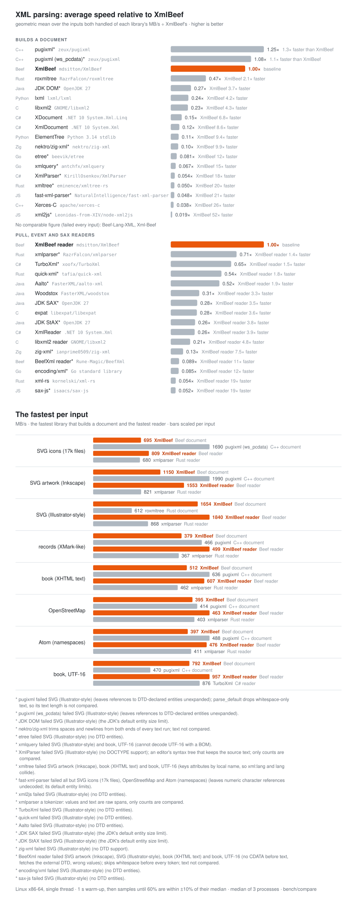

# XmlBeef

An XML 1.0 (Fifth Edition) + Namespaces parser and writer for the [Beef](https://www.beeflang.org/)
programming language, for reading data formats from disk (SVG first) fast, fully checked and with
located errors. The sibling of [TomlBeef](https://github.com/mdsitton/TomlBeef) and KdlBeef.

**Status: phase 7 of 7 (collect-errors done; the extras as needed).** The pull reader (`XmlReader`) and the document (`XmlDocument`), from
memory or a `Stream`, pass the W3C XML Conformance Test Suite's XML 1.0 Fifth Edition + Namespaces
selection (957 accepted, 950 of 951 rejected with golden-tested messages, the one a deliberate
encoding-conflict choice, and all 262 canonical outputs), and read all 2,390 SVGs of the W3C and
resvg corpora. UTF-8/16/32 and the common single-byte encodings, source positions and bounded entity
expansion are in, and documents can be edited and written back with only the changes regenerated
(every suite input and SVG round-trips byte for byte), and `[XmlObject]` types read and write
themselves through code generated at compile time. With collect-errors a read reports every error and
keeps going, for editors and linters. The plan, requirements and research are in `docs/`:

- [`docs/plan.md`](docs/plan.md) — requirements, design, phases, open questions
- [`docs/architecture.md`](docs/architecture.md) — how it works
- [`docs/status.md`](docs/status.md) — verification baseline and open items
- [`docs/spec-reference.md`](docs/spec-reference.md) — the XML 1.0 and Namespaces rules and edge cases
- [`docs/implementation-survey.md`](docs/implementation-survey.md) — existing implementations in Beef and
  eight other languages
- [`docs/test-suites.md`](docs/test-suites.md) — the W3C conformance suite and SVG corpora
- [`bench/compare/`](bench/compare/) — benchmark against 24 other implementations
  ([`results.md`](bench/compare/results.md), [`typed-results.md`](bench/compare/typed-results.md)):
  the document reads 1.65–2.7× as fast as roxmltree and the reader 1.4–2.7× quick-xml, the fastest
  reader on every input, all while passing every input

## License

MIT (see `LICENSE`).
